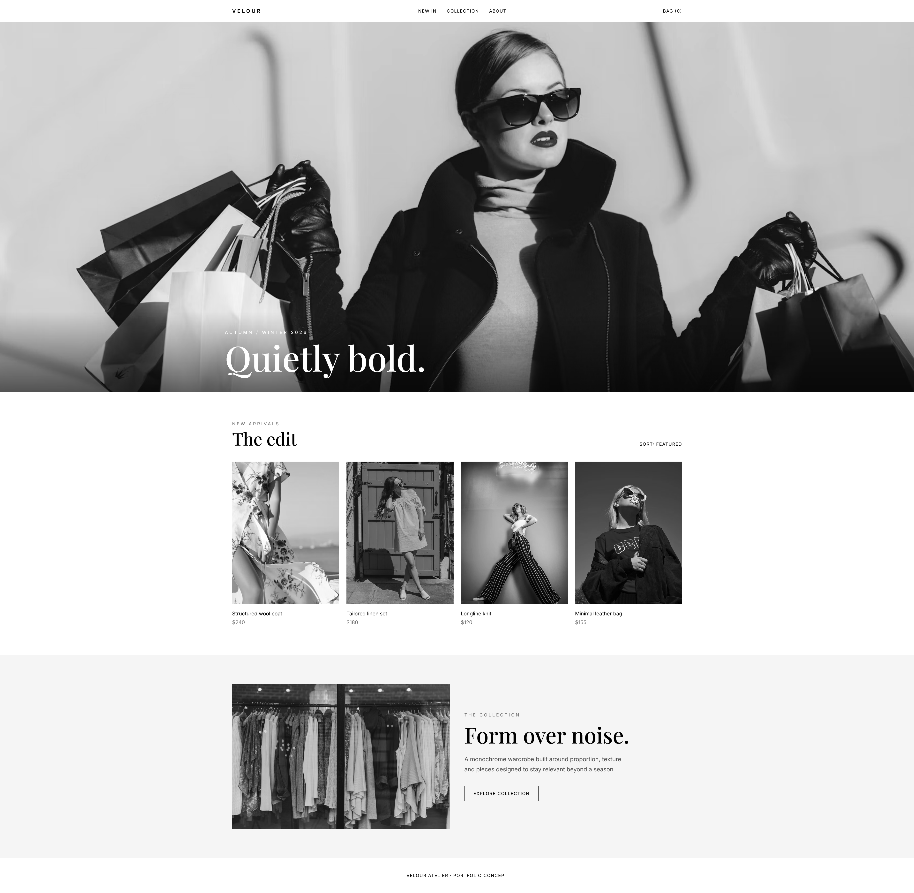
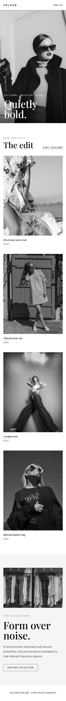

# Velour Atelier — Fashion Website

A sophisticated monochrome fashion website concept inspired by modern luxury editorial design.

## Preview

### Mobile Preview

## Live Demo

[View Live Demo](https://Bmax13.github.io/velour-atelier-fashion/)

## About the Project

Velour Atelier is a fashion and e-commerce website concept designed around a clean monochrome aesthetic and editorial-style presentation.

The project focuses on product imagery, typography, spacing and a premium visual experience.

## Features

* Responsive fashion website
* Monochrome visual design
* Product showcase
* Collection sections
* Editorial-style layout
* Responsive navigation
* Mobile-friendly design
* Interactive JavaScript elements
* Clean visual hierarchy

## Technologies

* HTML5
* Tailwind CSS
* JavaScript
* Responsive Design

## Purpose

This project was created as a frontend portfolio project to demonstrate the ability to build modern fashion and e-commerce interfaces with responsive layouts and a strong focus on visual presentation.
